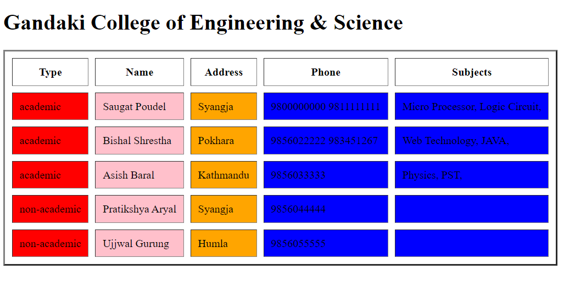

    Assignment Date - Tue June 21/22 - Wed June 22/22

    
Table Of Contents

Arrays In PHP
Types of Arrays in PHP
VIEW ARRAYS
PHP Sorting Arrays
PHP Functions For Sorting Arrays
Sorting Indexed Arrays in Descending Order
Arrays In PHP
Arrays are complex variables that allow us to store more than one value or a group of values under a single variable name. Let's suppose you want to store colors in your PHP script. Storing the colors one by one in a variable could look something like this: PHP <?php $color1 = "Red"; $color2 = "Green"; $color3 = "Blue"; ?>

Types of Arrays in PHP
Indexed array — An array with a numeric key.

<?php
$colors[0] = "Red"; 
$colors[1] = "Green"; 
$colors[2] = "Blue"; 
?>
Associative array — An array where each key has its own specific value.

  ```PHP 
  <?php
  $ages["Peter"] = "22";
  $ages["Clark"] = "32";
  $ages["John"] = "28";
  ?>
  ```
Multidimensional array — An array containing one or more arrays within itself.

<?php
// Define a multidimensional array
$contacts = array(
    array(
        "name" => "Peter Parker",
        "email" => "peterparker@mail.com",
    ),
    array(
        "name" => "Clark Kent",
        "email" => "clarkkent@mail.com",
    ),
    array(
        "name" => "Harry Potter",
        "email" => "harrypotter@mail.com",
    )
);
// Access nested value
echo "Peter Parker's Email-id is: " . $contacts[0]["email"];
?>
VIEW ARRAYS
You can see the structure and values of any array by using one of two statements — var_dump() or print_r(). The print_r() statement, however, gives somewhat less information. Consider the following example:

<?php
// Define array
$cities = array("London", "Paris", "New York");
 
// Display the cities array
print_r($cities);
?>
PHP Sorting Arrays
PHP Functions For Sorting Arrays
sort() and rsort() — For sorting indexed arrays
asort() and arsort() — For sorting associative arrays by value
ksort() and krsort() — For sorting associative arrays by key
<?php
// Define array
$colors = array("Red", "Green", "Blue", "Yellow");
 
// Sorting and printing array
sort($colors);
print_r($colors);
?>
        Array ( [0] => Blue [1] => Green [2] => Red [3] => Yellow ) 
Sorting Indexed Arrays in Descending Order
<?php
// Define array
$colors = array("Red", "Green", "Blue", "Yellow");

// Sorting and printing array
rsort($colors);
print_r($colors);
?>
        Array ( [0] => Yellow [1] => Red [2] => Green [3] => Blue )

        