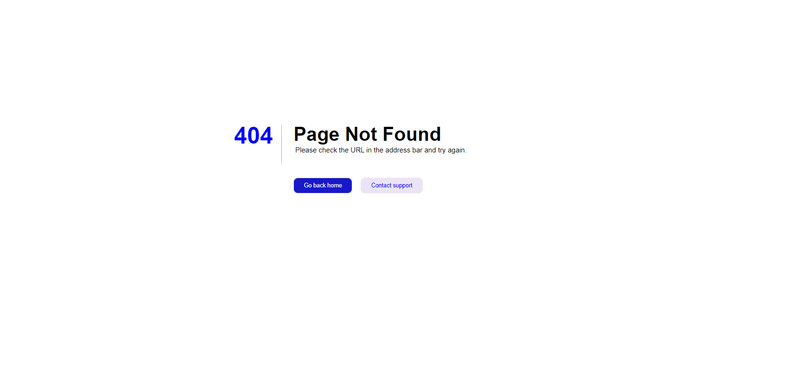
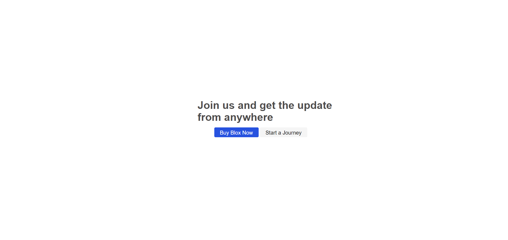
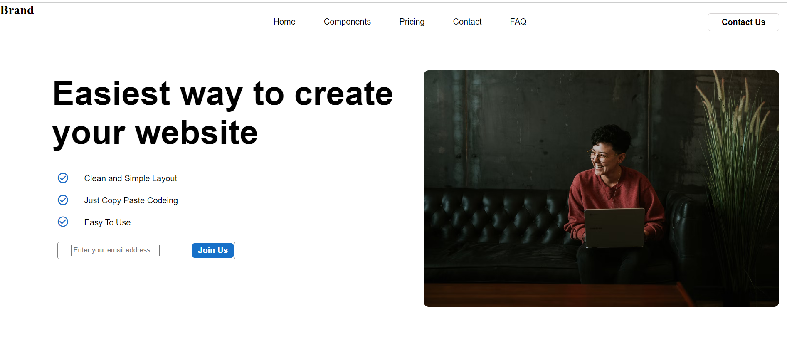
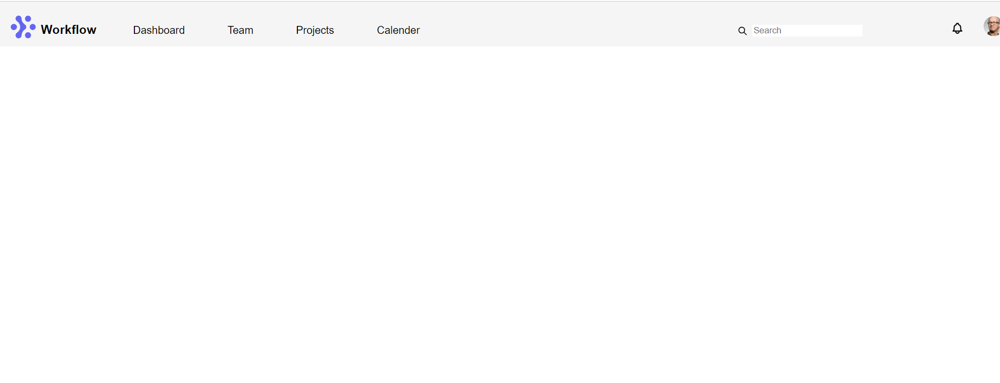

 
 Date:05/31/2022

Display property Position porperty Input tag SVG Icon tag Img tag

The display CSS property sets whether an element is treated as a block or inline element and the layout used for its children, such as flow layout, grid or flex. Formally, the display property sets an element's inner and outer display types. The outer type sets an element's participation in flow layout; the inner type sets the layout of children. Some values of display are fully defined in their own individual specifications; for example the detail of what happens when display: flex is declared is defined in the CSS Flexible Box Model specification.

display: inline-block; //The element generates a block element box that will be flowed with surrounding content as if it were a single inline box (behaving much like a replaced element would). display: inline; // The element generates a block element box that will be flowed with surrounding content as if it were a single inline box (behaving much like a replaced element would). display: block; //The element generates a block element box, generating line breaks both before and after the element when in the normal flow. display: flex; //The element behaves like an inline element and lays out its content according to the flexbox model.

The Button element The HTML element is an interactive element activated by a user with a mouse, keyboard, finger, voice command, or other assistive technology. Once activated, it then performs a programmable action, such as submitting a form or opening a dialog.

By default, HTML buttons are presented in a style resembling the platform the user agent runs on, but you can change buttons' appearance with CSS.

Absolute-The element is positioned relative to its first positioned (not static) ancestor element. Fixed-The element is positioned relative to the browser window Relative-The element is positioned relative to its normal position, so "left:20px" adds 20 pixels to the element's LEFT position

The tag specifies an input field where the user can enter data.

The element is the most important form element.

The element can be displayed in several ways, depending on the type attribute.

For eg- (default value)

What is SVG? SVG stands for Scalable Vector Graphics. SVG is used to define vector-based graphics for the Web. SVG defines the graphics in XML format Every element and every attribute in SVG files can be animated. SVG is a W3C recommendation. SVG integrates with other W3C standards such as the DOM and XSL.

To insert an icon, add the name of the icon class to any inline HTML element.

The and elements are widely used to add icons.

All the icons in the icon libraries below, are scalable vector icons that can be customized with CSS (size, color, shadow, etc.)